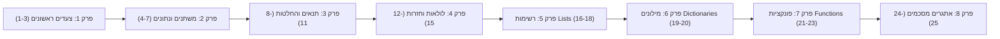

# 🐍 פייתון בקלות (Python Bekalut / PyTeen)
### *הפלטפורמה המובילה ללימוד תכנות פייתון בעברית נגישה, צעד אחר צעד — מאפס ועד למקצוענות!*

---

[](https://www.python.org/)
[](LICENSE)
[]()
[-purple.svg)]()
[]()
[](USER_GUIDE.md)

> 📖 **מחפש הדרכה קלה לשימוש באפליקציה, טיפים ללמידה וצילום מצב? עבור אל [מדריך למשתמש הקצה (USER_GUIDE.md)](USER_GUIDE.md)**

---

## 📑 תוכן העניינים
1. [🌟 שער וסקירה כללית](#-שער-וסקירה-כללית)
2. [🏗️ ארכיטקטורת המערכת](#️-ארכיטקטורת-המערכת)
   - [מבנה תיקיות וקבצי הפרויקט](#מבנה-תיקיות-וקבצי-הפרויקט)
   - [תרשים זרימת נתונים (Data Flow)](#תרשים-זרימת-נתונים-data-flow)
   - [מנגנון השרת (Native Python HTTP Server)](#מנגנון-השרת-native-python-http-server)
   - [מנוע הרצת הקוד והסנדבוקס (Code Evaluator & Sandbox)](#מנוע-הרצת-הקוד-והסנדבוקס-code-evaluator--sandbox)
   - [ממשק המשתמש (Modern Web SPA)](#ממשק-המשתמש-modern-web-spa)
3. [📚 תוכנית הלימודים המלאה (סילבוס מפורט)](#-תוכנית-הלימודים-המלאה-סילבוס-מפורט)
   - [פרקי הקורס הקיימים (שלבים 1–25)](#פרקי-הקורס-הקיימים-שלבים-125)
   - [סילבוס המשך והרחבות מתקדמות (Advanced Topics)](#סילבוס-המשך-והרחבות-מתקדמות-advanced-topics)
4. [✨ פיצ'רים ייחודיים](#-פיצרים-ייחודיים)
   - [מנטור בינה מלאכותית אישי (Gemini AI Prompt Engine)](#מנטור-בינה-מלאכותית-אישי-gemini-ai-prompt-engine)
   - [כרטיסיית 'התמונה הגדולה' (Big Picture & Roadmap)](#כרטיסיית-התמונה-הגדולה-big-picture--roadmap)
   - [עורך קוד אינטראקטיבי ומסוף פלט ייעודי](#עורך-קוד-אינטראקטיבי-ומסוף-פלט-ייעודי)
5. [🚀 הוראות הפעלה ודרישות מערכת](#-הוראות-הפעלה-ודרישות-מערכת)
6. [💡 מדריך לפיתוח והוספת תכנים](#-מדריך-לפיתוח-והוספת-תכנים)
7. [📜 רישיון וקרדיטים](#-רישיון-וקרדיטים)

---

## 🌟 שער וסקירה כללית

**"פייתון בקלות" (PyTeen)** היא מערכת אינטראקטיבית עצמאית ללימוד שפת התכנות פייתון (Python), שנבנתה מהיסוד במטרה להעניק חוויית למידה מהנה, אינטואיטיבית ומעצימה בשפה העברית.

### למה הפרויקט הוקם?
לימוד תכנות בקרב מתחילים, תלמידים ובני נוער נתקל לרוב בשני חסמים משמעותיים:
1. **מחסום השפה והניסוח:** מרבית חומרי הלימוד כתובים באנגלית טכנית, ומציגים הודעות שגיאה קריפטיות שגורמות לתסכול רב.
2. **חסם ההתקנות והסביבה:** התקנת ספריות כבדות, הגדרת משתני סביבה, פתרון קונפליקטים בגרסאות פייתון וממשקים מורכבים גורמים לתלמידים רבים להרים ידיים עוד לפני שכתבו שורת קוד אחת.

**"פייתון בקלות"** פותרת את שתי הבעיות הללו מן השורש:
* **אפס תלויות חיצוניות (Zero External Dependencies):** המערכת מבוססת על ספריות הליבה המובנות של פייתון בלבד (`http.server`, `socketserver`, `threading`, `json`). אין צורך להתקין אף חבילת `pip` צד-שלישי. מורידים, מריצים קובץ יחיד — והאפליקציה נפתחת ישירות בדפדפן!
* **חוויית למידה הוליסטית מונחית-מטרה:** כל שיעור מחבר את התלמיד לתמונה הרחבה – מדוע לומדים את הכלי, מתי משתמשים בו בעולם האמיתי (במשחקים, אתרים, מערכות בינה מלאכותית), וכיצד הוא מקדם אותו לעבר השלב הבא.
* **תרגום שגיאות חכם לעברית:** הודעות שגיאה כמו `SyntaxError`, `IndentationError`, `ZeroDivisionError` או לולאות אינסופיות מתורגמות להסברים ברורים, מעודדים ופרקטיים.
* **מנטור AI מובנה מותאם אישית:** מחולל פרומפטים בלחיצת כפתור המתאים עצמו לשלב המדויק של התלמיד ומאפשר ללמוד עם Gemini AI בצורה בטוחה ומדויקת לרמתו.

### קהל היעד
* **בני נוער ותלמידים (חטיבה ותיכון):** המעוניינים ללמוד לתכנת באופן עצמאי, לבנות משחקים ולהיכנס לעולם ההייטק.
* **מתחילים בכל גיל:** חסרי כל רקע קודם בתכנות, המחפשים מסלול הדרגתי, סבלני ומסביר פנים.
* **מורים, מדריכים ומנחי חוגי סייבר ותכנות:** כפלטפורמת תרגול בכיתה, ללא צורך בהתקנות מורכבות על מחשבי בית הספר.

---

## 🏗️ ארכיטקטורת המערכת

הפרויקט בנוי בארכיטקטורת **Client-Server (Web SPA)** קלת משקל ומהירה במיוחד, המנצלת את היכולות המובנות של שפת פייתון בצד השרת לצד ממשק דפדפן מתקדם ועשיר בצד הלקוח.

### מבנה תיקיות וקבצי הפרויקט

```plaintext
PyTeen/
├── index.html               # ממשק המשתמש המלא (Single Page Application - HTML5, CSS3, JS ES6+)
├── main.py                  # שרת HTTP מובנה בטוח, מנתב API ומאתר פורטים פנויים
├── run_app.bat              # סקריפט הפעלה מהירה ל-Windows בלחיצה אחת (UTF-8)
├── models/
│   ├── __init__.py
│   └── course_data.py       # מודל הנתונים של הקורס, 25 שיעורים ומחולל הפרומפטים ל-AI
├── utils/
│   ├── __init__.py
│   └── code_evaluator.py    # סנדבוקס מאובטח, תרגום שגיאות לעברית, ניהול Timeout ונרמול פלט
├── views/                   # רכיבי תצוגה מבוססי Flet (ארכיב/גרסה היברידית קודמת)
│   ├── home_view.py
│   └── lesson_view.py
└── README.md                # מסמך התיעוד והארכיטקטורה המקיף של הפרויקט
```

### פירוט רכיבי המערכת

| קובץ | תפקיד ארכיטקטוני | טכנולוגיות ומנגנונים |
| :--- | :--- | :--- |
| `main.py` | שרת האפליקציה הראשי וה-REST API | `http.server.BaseHTTPRequestHandler`, `socketserver.TCPServer`, `webbrowser`, `threading` |
| `index.html` | ממשק המשתמש (SPA) | Vanilla JS, CSS Grid & Flexbox, HTML5, LocalStorage, RTL Engine |
| `models/course_data.py` | מאגר התוכן הפדגוגי ומחולל ה-AI | מחלקת `Lesson`, מילוני תוכן עשירים, מנוע אינטגרציית Gemini Prompt |
| `utils/code_evaluator.py` | מנוע בידוד והרצת קוד (Sandbox) | `contextlib.redirect_stdout`, `io.StringIO`, `threading.Thread`, `queue.Queue` |
| `run_app.bat` | סקריפט הפעלה מיידי | Batch Scripting, UTF-8 Code Page (`chcp 65001`), Virtual Environment |

---

### תרשים זרימת נתונים (Data Flow)

התרשים הבא מציג את מעגל החיים של הרצת קוד ובדיקתו בתוך המערכת:

```mermaid
flowchart TD
    subgraph Browser ["🖥️ דפדפן הלקוח (Frontend SPA - index.html)"]
        UI["ממשק משתמש (Dark Mode + RTL)"]
        Editor["עורך קוד (Textarea + Shortcuts)"]
        LocalProg[("LocalStorage: שמירת התקדמות")]
        GeminiBtn["כפתור מנטור AI (העתקת פרומפט לג'מיני)"]
    end

    subgraph Server ["⚙️ שרת פייתון (Backend - main.py)"]
        Router{"PyTeenHandler (BaseHTTPRequestHandler)"}
        PortFinder["find_free_port() (8080/8550/5000/8000)"]
    end

    subgraph Evaluator ["🛡️ מנוע הערכה וסנדבוקס (utils/code_evaluator.py)"]
        WorkerThread["Worker Thread (Daemon)"]
        SafeEnv["סביבה מבודדת (safe_builtins)"]
        TimeoutCheck{"בדיקת Timeout (3.0 שניות)"}
        ErrTrans["תרגום שגיאות לעברית (translate_error)"]
        Normalizer["נרמול פלט (normalize_output)"]
    end

    subgraph DataStore ["📖 מאגר הנתונים הפדגוגי (models/course_data.py)"]
        CourseDB[("25 שלבים ב-8 פרקים")]
        PromptGen["מחולל פרומפטים מותאם אישית"]
    end

    %% זרימת נתונים ראשונית
    UI -->|1. בקשת שיעורים GET /api/lessons| Router
    Router -->|שליפה| CourseDB
    CourseDB -->|רשימת שיעורים + פרומפטים מובנים| Router
    Router -->|JSON Response| UI
    UI <-->|טעינה וסנכרון| LocalProg

    %% זרימת הרצת קוד
    Editor -->|2. לחיצה על 'הרץ קוד' POST /api/run {code, lesson_id}| Router
    Router -->|העברת קוד לניתוח| Evaluator
    Evaluator --> WorkerThread
    WorkerThread --> SafeEnv
    WorkerThread --> TimeoutCheck
    
    TimeoutCheck -->|חריגת זמן| ErrTrans
    TimeoutCheck -->|שגיאת קוד / תחביר| ErrTrans
    TimeoutCheck -->|הצלחה בריצה| Normalizer

    Normalizer -->|פלט מנורמל| Router
    ErrTrans -->|הודעת שגיאה בעברית| Router
    Router -->|3. תשובת JSON {passed, output, error, message}| UI
    UI -->|הצגת פלט במסוף + באנר הצלחה| UI
    UI -->|אם עבר בהצלחה: סימון ב-V ועדכון| LocalProg

    PromptGen -.->|הפקת פרומפט מותאם לפי שלב| GeminiBtn
```

---

### מנגנון השרת (Native Python HTTP Server)

במקום להסתמך על ספריות צד-שלישי כבדות (דוגמת Flask, FastAPI או Django) הדורשות התקנת שרתי WSGI/ASGI וניהול תלויות, `main.py` נשען על המודול המובנה `http.server`:
1. **איתור פורטים גמיש (`find_free_port`):** המערכת בודקת אוטומטית שורת פורטים נפוצים (`8080`, `8550`, `5000`, `8000`). אם פורט אחד תפוס (למשל על ידי תוכנה אחרת), המערכת עוברת באופן שקוף לפורט הבא הפנוי.
2. **מניעת נעילת פורטים (`allow_reuse_address = True`):** מחלקת `ReusableTCPServer` דורסת את הגדרות ברירת המחדל כדי לאפשר הרצה מחדש מהירה של השרת מבלי להיתקל בשגיאת מערכת `Address already in use`.
3. **פתיחת דפדפן אוטומטית:** תהליך רקע ייעודי (`threading.Thread`) ממתין חצי שנייה לעליית השרת ופותח ישירות את הדפדפן של המשתמש בכתובת המקומית, תוך שימוש בפקודת המערכת של Windows כגיבוי.
4. **ראוטינג של REST API פשוט ויעיל:**
   * `GET /`: הגשת קובץ ה-SPA הראשי `index.html`.
   * `GET /api/lessons`: שליפת רשימת כל השיעורים בפורמט JSON, כולל תוכן תיאורטי, דוגמאות קוד, פלט רצוי ופרומפטים ל-Gemini.
   * `POST /api/run`: קבלת קוד מהמשתמש, הרצתו במנוע ההערכה, אימות הפלט מול הפלט הצפוי של השיעור והחזרת תשובה מובנית.

---

### מנוע הרצת הקוד והסנדבוקס (Code Evaluator & Sandbox)

הרצת קוד שמשתמש כותב בדפדפן היא משימה רגישה. הקובץ `utils/code_evaluator.py` כולל שכבות הגנה ומנגנוני בקרה מתוחכמים:

#### 1. בידוד סביבת ההרצה (Safe Builtins Sandbox)
הקוד מורץ באמצעות פקודת `exec()` בתוך סביבה מוגבלת (`safe_env`):
* פקודות מערכת מסוכנות הוסרו או נוטרלו (אין גישה ל-`os.system`, `subprocess`, `open` או `import` בלתי מבוקר).
* הפונקציה `input()` נוטרלה והוחלפה בפונקציה מותאמת שמחזירה שגיאה אינטואיטיבית: `"קלט משתמש (input) אינו נתמך בסביבה זו. הגדר את הערך כמשתנה בקוד"`. בכך נמנעת תקיעה מוחלטת של השרת בהמתנה לקלט ב-CLI.
* הוגדרו Builtins בטוחים המאפשרים למידה מלאה: `print`, `range`, `len`, `int`, `float`, `str`, `bool`, `list`, `dict`, `set`, `tuple`, `sum`, `max`, `min`, `abs`, `round`, `sorted`, `reversed`, `enumerate`, `zip`, `type`.

#### 2. מניעת לולאות אינסופיות והגבלת זמן (Execution Timeout)
* הקוד מופעל בתוך **Thread נפרד (Worker Thread)** המוגדר כ-`daemon=True`.
* מופעלת המתנה עם `thread.join(timeout=3.0)`.
* אם הקוד רץ מעל 3 שניות (למשל בעקבות `while True:` ללא תנאי יציאה), ה-Thread מופסק ומוחזרת הודעת שגיאה ברורה: *"זמן הריצה חרג מ-3 שניות! ייתכן שיש בקוד לולאה אינסופית"*.

#### 3. לכידת פלט בטוחה (I/O Redirection)
באמצעות `contextlib.redirect_stdout(output_buffer)` ו-`io.StringIO()`, כל פלט שנכתב בפקודת `print()` נלכד במלואו מבלי לזהם את מסוף השרת, ומועבר בצורה מבוקרת חזרה ללקוח דרך `queue.Queue`.

#### 4. מנוע תרגום שגיאות חכם לעברית (`translate_error`)
מתחילים רבים נבהלים מ-Traceback ארוך ומנוכר באנגלית. המערכת סורקת את מחרוזת השגיאה ומתרגמת אותה להסבר ישיר, חם ומכוון לפעולה:
* **SyntaxError / unclosed:** *"אופס! נראה ששכחת לסגור סוגריים או גרשיים בסוף. בדוק שוב את השורה!"*
* **SyntaxError כללי:** *"שגיאת תחביר (SyntaxError): יש טעות כתיב בקוד, או שחסר פסיק / נקודתיים (:) במקום כלשהו."*
* **IndentationError:** *"שגיאת הזחה (IndentationError): בפייתון הרווחים בתחילת השורה קריטיים! ודא שכל הפקודות מיושרות ומודגשות בהזחה נכונה."*
* **NameError:** *"שגיאת שם (NameError): השתמשת במשתנה או בפקודה שלא הוגדרו קודם לכן. בדוק שאין שגיאת איות באנגלית."*
* **TypeError:** *"שגיאת סוג (TypeError): ניסית לבצע פעולה בין סוגי נתונים שלא מתאימים (למשל לחבר מספר עם טקסט ללא המרה)."*
* **ZeroDivisionError:** *"חלוקה באפס (ZeroDivisionError): במתמטיקה ובפייתון אי אפשר לחלק מספר ב-0!"*
* **IndexError:** *"חריגה מהרשימה (IndexError): ניסית לגשת לאיבר במיקום שאינו קיים ברשימה."*
* **ValueError:** *"ערך לא חוקי (ValueError): הערך שהועבר אינו תואם למה שהפונקציה מצפה לקבל."*
* **Timeout:** *"זמן הריצה חרג מ-3 שניות! ייתכן שיש בקוד לולאה אינסופית (כמו while True ללא עצירה)."*

#### 5. נרמול פלט להשוואה הוגנת (`normalize_output`)
לעיתים קרובות תלמיד פותר תרגיל נכון, אך מוסיף רווח בודד בסוף השורה או ירידת שורה עודפת. פונקציית הנרמול ממירה מעברי שורה (`\r\n` ל-`\n`), מסירה רווחים עיוורים בסופי שורות (`rstrip`) וגוזרת שורות ריקות בקצוות, כך שהבדיקה תהיה הוגנת, אמינה ומעודדת.

---

### ממשק המשתמש (Modern Web SPA)

הממשק בקובץ `index.html` פותח בסטנדרטים הגבוהים ביותר של פיתוח Web:
* **עיצוב מודרני מרהיב (Dark Mode Theme):** פלטת צבעים נעימה לעיניים (רקע Slate כהה `#0f172a`, כרטיסיות `#1e293b`, גבולות עדינים `#334155`, כפתורי פעולה בצבעי תכלת שמיים `#38bdf8`, סגול `#a855f7` וירוק הצלחה `#22c55e`).
* **חוויית RTL מלאה וטבעית:** יישור מדויק מימין לשמאל, טיפוגרפיה ברורה, לצד שמירה על עורך קוד ומסוף פלט מיושרים לשמאל (LTR) עם גופן מונוספייס מקצועי (Consolas / Fira Code).
* **ניהול התקדמות ב-LocalStorage:** כל שלב שהושלם נשמר מיד ב-`localStorage` של הדפדפן. המשתמש יכול לרענן את העמוד, לסגור את הדפדפן ולחזור בכל עת – הסטטוס, ה-V הירוק בסרגל והאחוזים בסרגל ההתקדמות נשמרים במלואם.
* **מסך מפוצל רספונסיבי (Split Workspace):**
  * **צד ימין (תיאוריה והדרכה):** כותרת, תגיות שלב, כרטיסיית 'התמונה הגדולה', הסבר מפורט, טיפ זהב, רמז מתקפל, כרטיסיית Gemini AI וכפתורי ניווט.
  * **צד שמאל (סביבת פיתוח ומסוף):** סרגל כלים עם איפוס והרצה, עורך קוד עם מספרי שורות וירטואליים, ומסוף פלט חי עם משוב מיידי (באנר ירוק בהצלחה, באנר אזהרה צהוב בהבדלי פלט, באנר שגיאה אדום בשגיאות קוד).

---

## 📚 תוכנית הלימודים המלאה (סילבוס מפורט)

תוכנית הלימודים ב-"פייתון בקלות" נבנתה במחשבה פדגוגית מעמיקה, שבה כל נושא נשען על קודמו ומוביל לנושא הבא באופן חלק.

### פרקי הקורס הקיימים (שלבים 1–25)



#### פרק 1: צעדים ראשונים
* **שלב 1: שלום עולם!**
  * *נושא:* פקודת ההדפסה `print()`, מחרוזות ומירכאות.
  * *למה לומדים:* יצירת הגשר הראשון לתקשורת בין המפתח למחשב.
  * *מתי נשתמש:* הצגת הודעות, פלט נתונים למשתמש, ובדיקת ערכי ביניים בעת ניפוי שגיאות (Debugging).
* **שלב 2: מספרים וחישובים**
  * *נושא:* פעולות חשבון בסיסיות בפייתון (`+`, `-`, `*`, `/`).
  * *למה לומדים:* המחשב כמכונת חישוב מהירה בבסיס כל אלגוריתם, משחק או אפליקציה.
  * *מתי נשתמש:* עדכון ניקוד, חישוב מחירים בעגלת קניות, חישובי זמנים ומרחקים.
* **שלב 3: הדפסת כמה ערכים יחד**
  * *נושא:* שילוב מספר ערכים ומחרוזות בפקודת `print()` מופרדים בפסיק.
  * *למה לומדים:* הצגת משפטים עשירים המשלבים תוויות מלל לצד תוצאות של חישובים.
  * *מתי נשתמש:* הודעות משתמש כגון: `"התוצאה היא: 42"`.

#### פרק 2: משתנים וסוגי נתונים
* **שלב 4: יצירת משתנים**
  * *נושא:* הגדרת משתנה, סימן ההשמה (`=`), זיכרון המחשב.
  * *למה לומדים:* היכולת לאחסן מידע דינמי בזיכרון ולהשתמש בו שוב ושוב לאורך התוכנית.
  * *מתי נשתמש:* שמירת שם שחקן, ניקוד, כתובת אימייל או יתרת חשבון.
* **שלב 5: חיבור משתנים ו-f-strings**
  * *נושא:* שרשור מחרוזות ושימוש במחרוזות מעוצבות `f"..."`.
  * *למה לומדים:* הדרך המודרנית, הקריאה והאלגנטית ביותר להטמיע משתנים בתוך טקסט.
  * *מתי נשתמש:* הודעות מותאמות אישית, תבניות אימייל ודוחות דינמיים.
* **שלב 6: המרת סוגי נתונים (Casting)**
  * *נושא:* פונקציות המרה: `str()`, `int()`, `float()`.
  * *למה לומדים:* הבנת טיפוסי הנתונים בפייתון ומניעת שגיאות חיבור בין טקסט למספר.
  * *מתי נשתמש:* קבלת נתונים מטפסים ועיבודם כמספרים לחישובים מתמטיים.
* **שלב 7: ערכים בוליאניים (True / False)**
  * *נושא:* סוג הנתונים הבוליאני (`bool`), השוואות (`==`, `>`, `<`).
  * *למה לומדים:* הבסיס לקבלת החלטות לוגיות במחשב (כן / לא, אמת / שקר).
  * *מתי נשתמש:* בדיקת סטטוס התחברות משתמש, האם המשחק נגמר, האם מוצר קיים במלאי.

#### פרק 3: תנאים והחלטות
* **שלב 8: תנאי if בסיסי**
  * *נושא:* מבנה בקרה `if`, הזחות (Indentation) וסימן הנקודתיים (`:`).
  * *למה לומדים:* הפיכת הקוד לחכם ודינמי המבצע פעולות רק כאשר מתקיים תנאי מסוים.
  * *מתי נשתמש:* בדיקה האם המשתמש הזין סיסמה נכונה, או האם ניקוד השחקן עבר רף מסוים.
* **שלב 9: תנאי if ו-else**
  * *נושא:* פיצול נתיבי ביצוע באמצעות `if` ו-`else`.
  * *למה לומדים:* מתן מענה לשני התרחישים – מה עושים אם התנאי התקיים, ומה עושים אם לא.
  * *מתי נשתמש:* הצלחה או כישלון בהתחברות, אישור או דחייה של עסקת תשלום.
* **שלב 10: תנאי מרובה עם elif**
  * *נושא:* בדיקת שרשרת תנאים באמצעות `elif` (Else If).
  * *למה לומדים:* טיפול במספר רב של אפשרויות שונות מבלי להסתבך בתנאים מקוננים ומסורבלים.
  * *מתי נשתמש:* חישוב ציונים (מצוין, טוב, נכשל), קביעת רמות קושי במשחק, או תפריטי ניווט.
* **שלב 11: תנאים מורכבים (and / or)**
  * *נושא:* אופרטורים לוגיים לחיבור תנאים (`and`, `or`).
  * *למה לומדים:* בדיקת מצבים מורכבים הדורשים מספר קריטריונים בו-זמנית.
  * *מתי נשתמש:* אימות משתמש (שם משתמש נכון **וגם** סיסמה נכונה), בדיקת הרשאות (מנהל **או** בעל גישה).

#### פרק 4: לולאות וחזרות
* **שלב 12: לולאת for וטווח range**
  * *נושא:* לולאות `for` ופונקציית `range(stop)`.
  * *למה לומדים:* ביצוע פעולות שחוזרות על עצמן מספר קבוע של פעמים ביעילות מירבית.
  * *מתי נשתמש:* הדפסת לוח הכפל, שליחת 100 הודעות, אנימציה של מספר פריימים.
* **שלב 13: טווח מותאם ב-range**
  * *נושא:* `range(start, stop, step)` – הגדרת התחלה, סוף וקפיצות.
  * *למה לומדים:* שליטה מלאה בטווחי ספירה (ספירה בדילוגים, ספירה לאחור).
  * *מתי נשתמש:* ספירה לאחור לשיגור טיל, הדפסת מספרים זוגיים בלבד.
* **שלב 14: לולאת while**
  * *נושא:* לולאות מותנות `while`, משתני בקרה ועדכון מונה.
  * *למה לומדים:* הרצת קוד שחוזר על עצמו כל עוד תנאי מסוים מתקיים (ללא ידיעה מראש כמה פעמים נצטרך לרוץ).
  * *מתי נשתמש:* לולאת המשחק הראשית (כל עוד השחקן בחיים), המתנה לקבלת נתונים מהרשת.
* **שלב 15: יציאה מוקדמת עם break**
  * *נושא:* פקודת `break` לעצירה מיידית של לולאה.
  * *למה לומדים:* מניעת ריצות מיותרות של לולאה כאשר המטרה כבר הושגה.
  * *מתי נשתמש:* חיפוש פריט ברשימה ועצירה ברגע שנמצא, יציאה מתוכנית לבקשת המשתמש.

#### פרק 5: רשימות (Lists)
* **שלב 16: יצירת רשימה ושליפת איברים**
  * *נושא:* מבנה הנתונים רשימה (`[]`), אינדקסים המתחילים מ-0.
  * *למה לומדים:* שמירה וארגון של אוספי נתונים מרובים במשתנה יחיד.
  * *מתי נשתמש:* רשימת תלמידים בכיתה, פלייליסט של שירים, תוצאות חיפוש בגוגל.
* **שלב 17: הוספה לרשימה (append) ואורך (len)**
  * *נושא:* מתודת `append()` ופונקציית `len()`.
  * *למה לומדים:* ניהול רשימות דינמיות שמשתנות וגדלות בזמן אמת.
  * *מתי נשתמש:* הוספת מוצר לעגלת קניות, הוספת הודעה חדשה לקבוצת וואטסאפ.
* **שלב 18: מעבר על רשימה בלולאה**
  * *נושא:* איטרציה על איברי הרשימה (`for item in my_list:`).
  * *למה לומדים:* עיבוד וסריקה של כמויות מידע גדולות במהירות.
  * *מתי נשתמש:* הצגת פיד פוסטים ברשת חברתית, חישוב סכום של כל המוצרים בעגלה.

#### פרק 6: מילונים (Dictionaries)
* **שלב 19: מה זה מילון? (Key - Value)**
  * *נושא:* מבנה הנתונים מילון (`{}`), זוגות מפתח וערך.
  * *למה לומדים:* ייצוג ישויות מורכבות בעלות תכונות ברורות בעלות משמעות סמנטית.
  * *מתי נשתמש:* כרטיס פרופיל משתמש (שם, גיל, עיר), פריט בקטלוג (דגם, מחיר, צבע).
* **שלב 20: עדכון והוספת ערכים במילון**
  * *נושא:* גישה למפתחות, עדכון ערך קיים והוספת מפתחות חדשים.
  * *למה לומדים:* עדכון מצב האובייקט בזמן אמת לאורך פעילות המערכת.
  * *מתי נשתמש:* עדכון ניקוד של שחקן, שינוי כתובת למשלוח, שמירת הגדרות אפליקציה.

#### פרק 7: פונקציות (Functions)
* **שלב 21: הגדרת פונקציה ראשונה (def)**
  * *נושא:* מילת המפתח `def`, קריאה לפונקציה, עקרון שימוש חוזר בקוד (DRY - Don't Repeat Yourself).
  * *למה לומדים:* ארגון הקוד לקוביות בנייה עצמאיות ובעלות שם, המונעות שכפול קוד.
  * *מתי נשתמש:* פעולות קבועות שחוזרות על עצמן כמו הצגת כותרת תפריט או איפוס לוח משחק.
* **שלב 22: פונקציה עם פרמטרים**
  * *נושא:* העברת ארגומנטים ופרמטרים לפונקציה.
  * *למה לומדים:* יצירת פונקציות גמישות שמבצעות פעולה מותאמת לפי קלט ספציפי.
  * *מתי נשתמש:* פונקציית חישוב שטח לפי אורך ורוחב, פונקציית שליחת ברכה לפי שם המשתמש.
* **שלב 23: החזרת ערך עם return**
  * *נושא:* פקודת `return` מול הדפסה, קבלת ערך מפונקציה למשתנה חיצוני.
  * *למה לומדים:* הבסיס לתכנות מודולרי שבו פונקציה מחשבת תוצאה ומעבירה אותה לשלבים הבאים.
  * *מתי נשתמש:* חישוב מחיר סופי כולל מע"מ, בדיקת תקינות סיסמה, המרת מטבעות.

#### פרק 8: אתגרים מסכמים
* **שלב 24: אתגר הסינון (זוגי או אי זוגי)**
  * *נושא:* אופרטור השארית מודולו (`%`), שילוב פונקציה, תנאי ו-`return`.
  * *למה לומדים:* יישום אלגוריתמי מעשי ראשון המשלב את כל הכלים שנלמדו.
  * *מתי נשתמש:* בדיקת זוגיות, ניהול תורים וסבבים במשחקים (תור שחקן 1 או 2), חלוקת משימות במערכות מבוזרות.
* **שלב 25: אתגר ה-FizzBuzz המפורסם!**
  * *נושא:* שילוב לולאת `range`, תנאים מרובים (`elif`), אופרטורים לוגיים (`and`) ומודולו (`%`).
  * *למה לומדים:* מבחן הסינון הקלאסי והמפורסם ביותר בראיונות עבודה להייטק בעולם כולו!
  * *מתי נשתמש:* פתרון בעיות אלגוריתמיות מורכבות, בדיקת חלוקה מרובה, הוכחת שליטה מוחלטת ביסודות השפה.

---

### סילבוס המשך והרחבות מתקדמות (Advanced Topics Roadmap)

עבור שלבי הפיתוח הבאים של הקורס, מתוכננים פרקים מתקדמים שירחיבו את ארגז הכלים של הלומד:

```plaintext
├── פרק 9: תכנות מונחה עצמים (Object-Oriented Programming - OOP)
│   ├── שיעור 26: מהי מחלקה (class) ומהו מופע (instance/object)
│   ├── שיעור 27: הבנאי __init__ ומשתנה ה-self
│   ├── שיעור 28: מתודות (Methods) ופעולות על אובייקטים
│   ├── שיעור 29: הורשה (Inheritance) ושימוש חוזר בתכונות
│   └── שיעור 30: דריסת מתודות (Override) ופולימורפיזם
│
├── פרק 10: טיפול בחריגות ושגיאות (Exception Handling)
│   ├── שיעור 31: מנגנון try ו-except לתפיסת שגיאות
│   ├── שיעור 32: סוגי חריגות ספציפיות (ValueError, ZeroDivisionError)
│   └── שיעור 33: בלוקי else ו-finally, וזריקת שגיאות יזומות עם raise
│
├── פרק 11: עבודה עם קבצים (File I/O)
│   ├── שיעור 34: פתיחה וקריאה של קבצי טקסט עם with open()
│   ├── שיעור 35: כתיבה ויצירת קבצים חדשים (w, a)
│   └── שיעור 36: עבודה עם קבצי נתונים מובנים (JSON Parsing)
│
├── פרק 12: מודולים וספריות סטנדרטיות (Python Standard Library)
│   ├── שיעור 37: ייבוא מודולים באמצעות import ו-from ... import
│   ├── שיעור 38: מודול random (הגרלת מספרים, בחירת פריטים לרולטה/משחקים)
│   ├── שיעור 39: מודול math (פונקציות מתמטיות מתקדמות, חזקות ושורשים)
│   └── שיעור 40: מודול datetime (מדידת זמנים, תאריכים ושעונים)
│
└── פרק 13: מבני נתונים מתקדמים ופייתון אידיומטי
    ├── שיעור 41: טאפלים (Tuples) - רשימות שאינן ניתנות לשינוי
    ├── שיעור 42: קבוצות (Sets) - מניעת כפילויות ופעולות קבוצתיות
    └── שיעור 43: גזירת רשימות (List Comprehensions) לקוד תמציתי ומלוטש
```

---

## ✨ פיצ'רים ייחודיים

### מנטור בינה מלאכותית אישי (Gemini AI Prompt Engine)

אחד החידושים הפדגוגיים המשמעותיים ביותר ב-"פייתון בקלות" הוא מנוע יצירת הפרומפטים המובנה ב-`models/course_data.py` (`get_gemini_prompt()`):

#### הבעיה הנפוצה עם AI בלימוד תכנות
כאשר תלמיד מתחיל שואל מודל AI (כמו Gemini או ChatGPT) שאלה בסיסית, המודל נוטה לעיתים קרובות להשתמש במושגים מורכבים ומופשטים שטרם נלמדו (למשל: שימוש במחלקות, פונקציות למבדה, ספריות צד-שלישי או טיפול בשגיאות), מה שמבלבל את התלמיד ומייצר תסכול.

#### הפתרון של "פייתון בקלות"
המערכת מייצרת באופן דינמי פרומפט קפדני ומדויק המועבר ל-Gemini, הכולל:
1. **מיפוי ידע מצטבר:** פירוט מדויק של כל הנושאים והכלים שהתלמיד הספיק ללמוד עד לשלב הנוכחי.
2. **הנחיה פדגוגית קשיחה:** איסור מפורש על שימוש בכלים ומושגים שלא נלמדו עדיין.
3. **הקשר מלא של התרגיל הנוכחי:** כותרת השיעור, מטרתו, והקוד המדויק שהתלמיד עובד עליו.
4. **מבנה תשובה ב-5 רבדים ברורים:**
   * **הסבר אינטואיטיבי:** משל או אנלוגיה מחיי היומיום.
   * **הסבר טכני מותאם:** כיצד פייתון מריצה ומבינה את הפקודה מאחורי הקלעים.
   * **2 דוגמאות שימוש מהחיים:** מעולם המשחקים או האפליקציות, המשתמשות אך ורק בכלים המוכרים לו.
   * **חיבור להמשך והתמדה:** משפט מעודד המסביר כיצד שלב זה מהווה גשר לשלב הבא.
   * **אתגר חשיבה קטן:** שאלת הבנה קצרה עם רמז.
5. **ממשק נגיש:** כפתור העתקה בלחיצה אחת (`📋 העתק פרומפט לג'מיני`) וכפתור לפתיחת Gemini ישירות בדפדפן.

---

### כרטיסיית 'התמונה הגדולה' (Big Picture & Roadmap)

בכל שיעור מופיע כרטיס ייעודי בעל 4 מקטעים שמטרתו להעניק תמונת מצב קוגניטיבית ברורה:
* **🔄 מה למדנו עד עכשיו? (Recap):** חיבור לידע הקודם שכבר נרכש.
* **🎯 למה אנחנו לומדים את זה? (Why Learn):** הערך המעשי של הכלי הנוכחי.
* **🛠️ מתי ואיך נשתמש בזה? (When to Use):** תרחישים אמיתיים מהתעשייה.
* **🔭 מה צפוי לנו בהמשך המסע? (Next Steps):** הצצה לשלב הבא המעוררת סקרנות ורצון להתמיד.

---

### עורך קוד אינטראקטיבי ומסוף פלט ייעודי

* **תמיכה מובנית במקש Tab:** הזחה תקנית של 4 רווחים בדיוק במיקום הסמן (מונע שגיאות הזחה קריטיות בפייתון).
* **קיצור דרך מהיר להרצה:** לחיצה על `Ctrl + Enter` (או `Cmd + Enter` ב-Mac) מריצה את הקוד מיד ללא צורך בעכבר.
* **איפוס קוד מהיר:** כפתור `🔄 איפוס קוד` מחזיר את קוד ברירת המחדל של השיעור אם התלמיד הסתבך ורוצה להתחיל מחדש.
* **רמזים מתקפלים:** כפתור `💡 רמז לפתרון` מאפשר לקבל עזרה נקודתית מבלי לחשוף את הפתרון המלא מראש.
* **מסוף פלט עשיר:** מציג את תוצאת הריצה המדויקת, זמני ריצה, סטטוס סיום, והודעות משוב מעוצבות.

---

## 🚀 הוראות הפעלה ודרישות מערכת

### דרישות מוקדמות
* **מערכת הפעלה:** Windows 10/11, macOS, או Linux.
* **גרסת פייתון:** Python 3.10 ומעלה מותקן במחשב (כולל סימון "Add Python to PATH" בעת ההתקנה).
* **דפדפן אינטרנט:** Chrome, Edge, Firefox, Brave, Safari או כל דפדפן מודרני אחר.

---

### הפעלה מהירה (Windows בלחיצה אחת)
1. היכנס לתיקיית הפרויקט: `c:\Users\User\Desktop\תכנות\PyTeen`.
2. לחץ פעמיים על הקובץ: **`run_app.bat`**.
3. השרת יופעל מיד, וחלון הדפדפן ייפתח אוטומטית בכתובת המקומית (למשל: `http://localhost:8080`).

---

### הפעלה ידנית מכל מערכת הפעלה (Terminal / Shell)

```bash
# 1. ניווט לתיקיית הפרויקט
cd /path/to/PyTeen

# 2. (אופציונלי) יצירה והפעלה של סביבה וירטואלית
python -m venv venv
# ב-Windows:
venv\Scripts\activate
# ב-macOS/Linux:
source venv/bin/activate

# 3. הפעלת השרת
python main.py
```

לאחר ההפעלה, ייפתח הדפדפן בכתובת:
👉 **`http://localhost:8080`** (או פורט חלופי פנוי המוצג בטרמינל).

---

### פתרון תקלות נפוצות (Troubleshooting)

| תופעה | סיבה אפשרית | פתרון מומלץ |
| :--- | :--- | :--- |
| **הדפדפן אינו נפתח אוטומטית** | חסימת הרשאות מערכת | פתח ידנית את הדפדפן וגלוש לכתובת: `http://localhost:8080` (בדוק את הפורט שהודפס במסוף). |
| **שגיאת `Python not found`** | פייתון אינו מוגדר ב-PATH | התקן מחדש את פייתון וסמן ב-V את האפשרות `Add Python to PATH`. |
| **עברית מופיעה כסימני שאלה ב-CMD** | קידוד חלון הטרמינל אינו UTF-8 | הקובץ `run_app.bat` כולל פקודת `chcp 65001`. בהפעלה ידנית, הרץ פקודה זו לפני הפעלת הסקריפט. |
| **פורט 8080 תפוס** | שירות אחר רץ על אותו פורט | המערכת מזהה זאת אוטומטית ועוברת לפורט פנוי (`8550`, `5000` או `8000`). |

---

## 💡 מדריך לפיתוח והוספת תכנים

הפרויקט בנוי בצורה מודולרית המאפשרת הוספת שיעורים חדשים בקלות רבה בתוך `models/course_data.py`.

### כיצד להוסיף שיעור חדש?
פתח את הקובץ `models/course_data.py` והוסף מופע חדש של `Lesson` לרשימת `LESSONS`:

```python
Lesson(
    id=26,
    chapter="פרק 9: תכנות מונחה עצמים",
    title="שלב 26: הגדרת מחלקה ראשונה (class)",
    recap="למדנו להגדיר פונקציות ומילונים לייצוג נתונים.",
    why_learn="מחלקות מאפשרות לאחד נתונים והתנהגויות לתבנית אחת חכמה.",
    when_to_use="נשתמש במחלקות לבניית דמויות במשחק, ישויות משתמש במערכת או רכבים בסימולטור.",
    explanation="כדי להגדיר מחלקה משתמשים במילת המפתח class:\nclass Dog:\n    pass",
    tip="💡 שמות מחלקות נהוג להתחיל באות גדולה באנגלית (PascalCase).",
    default_code="class Dog:\n    name = 'טופי'\n\nd = Dog()\nprint(d.name)",
    expected_output="טופי",
    hint="הגדר את המחלקה Dog וצור מופע שלה בעזרת סוגריים Dog().",
    success_message="כל הכבוד! הגדרת את המחלקה הראשונה שלך!"
)
```

לאחר שמירת הקובץ ורענון הדפדפן, השיעור החדש יופיע מיד בסרגל הניווט, סרגל ההתקדמות יתעדכן בהתאם, ומחולל הפרומפטים של Gemini AI ייצר עבורו הקשר מלא אוטומטית!

---

## 📜 רישיון וקרדיטים

* **פיתוח ופדגוגיה:** צוות פיתוח פרויקט "פייתון בקלות" (PyTeen).
* **רישיון:** מופץ תחת רישיון **MIT**. מותר לשימוש, שיתוף, שינוי והוראה חופשית למטרות חינוכיות.
* **הוקרה:** תודה מיוחדת לקהילת מפתחי הפייתון בישראל ולכל אנשי החינוך המנגישים טכנולוגיה ומדעי המחשב לדור העתיד.

---
<div align="center">
  <sub>נבנה באהבה עבור הדור הבא של מהנדסי התוכנה בישראל 🇮🇱 💻 🚀</sub>
</div>
